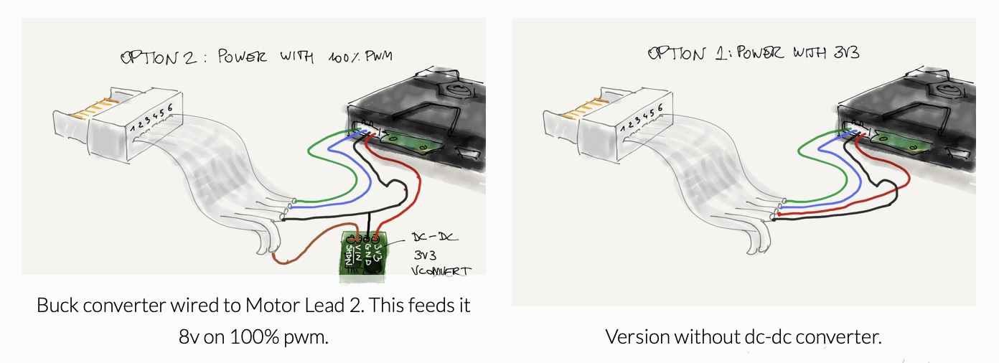

<div align="center">


# PyHuskyLens

[](LICENSE)
[](https://pypi.org/project/pyhuskylens/)
[](https://pypi.org/project/pyhuskylens/)
[](https://micropython.org/)

A universal Python library for connecting the HuskyLens AI camera to robotics platforms. Supports both V1 and V2 hardware with I2C and Serial (UART) interfaces. Works with MicroPython (LEGO, ESP32) and CPython (Raspberry Pi). Perfect for LEGO robotics, ESP32 projects, Raspberry Pi vision systems, and any Python-enabled device.

</div>

## Table of Contents

- [Features](#features)
- [Installation](#installation)
- [Quick Start](#quick-start)
- [Hardware Connection](#hardware-connection)
- [Example Projects](#example-projects)
- [API Reference](#api-reference)
- [Supported Platforms](#supported-platforms)
- [Troubleshooting](#troubleshooting)
- [License](#license)
- [Author](#author)

## Features

- 🤖 **Auto-detection**: Automatically detects HuskyLens V1 or V2 hardware
- 🔌 **Dual Interface**: Supports both I2C and Serial (UART) communication
- 🐍 **Dual Platform**: Works with MicroPython and CPython (Raspberry Pi)
- 🍓 **Raspberry Pi Compatible**: Native support for Raspberry Pi I2C and Serial
- 🎯 **Full Algorithm Support**: All 14 AI algorithms including face recognition, object tracking, pose detection, hand recognition, and more
- 🦾 **Extended Detection**: Full V2 support with facial landmarks, 21-point hand keypoints, and 17-point body pose
- 💾 **Memory Optimized**: Efficient bytearrays and data structures for MicroPython
- 🔄 **Backward Compatible**: Unified `HuskyLens()` constructor works with all platforms
- 🧩 **Clean Architecture**: Base class pattern with separate I2C and Serial implementations
- 📦 **Platform Agnostic**: Works with pybricks-micropython, standard MicroPython, SPIKE, Robot Inventor, and Raspberry Pi CPython

## Installation

### SPIKE Prime and Robot Inventor 51515

Copy and paste the contents of [pyhuskylens/pyhuskylens.py](pyhuskylens/pyhuskylens.py) above your script.

### ESP32 / MicroPython

#### Recommended: Using ViperIDE

The easiest way to install is using [ViperIDE](https://viper-ide.org/):

1. Open ViperIDE in your browser
2. Connect to your ESP32 device
3. Go to **Tools** → **Install package via link**
4. Enter: `github:antonvh/PyHuskyLens`
5. Click Install

#### Alternative: Using mip

Install from your device (if internet-connected):

```python
import mip
mip.install("github:antonvh/PyHuskyLens")
```

#### Manual Installation

Copy `pyhuskylens/pyhuskylens.py` to your device's filesystem.

### EV3 with pybricks-micropython

Copy the library file to your project and import directly.

### Raspberry Pi (CPython)

Install from PyPI:

```bash
pip install pyhuskylens
```

For I2C support, install smbus2:

```bash
pip install pyhuskylens[i2c]
```

For Serial/UART support, install pyserial:

```bash
pip install pyhuskylens[serial]
```

For both I2C and Serial:

```bash
pip install pyhuskylens[all]
```

## Quick Start

### Raspberry Pi I2C

```python
from pyhuskylens import HuskyLens, ALGORITHM_OBJECT_RECOGNITION

# Use I2C bus number (0 or 1, typically 1 on Raspberry Pi)
hl = HuskyLens(1)  # Automatically uses HuskyLensI2C_RPi

if hl.knock():
    print("Connected to HuskyLens V" + str(hl.version))
    
    # Set algorithm
    hl.set_alg(ALGORITHM_OBJECT_RECOGNITION)
    
    # Get detected objects
    blocks = hl.get_blocks()
    print("Found " + str(len(blocks)) + " objects")
    
    for block in blocks:
        print("Object at ({},{}) size {}x{}".format(
            block.x, block.y, block.width, block.height))
```

### Raspberry Pi Serial

```python
from pyhuskylens import HuskyLens, ALGORITHM_FACE_RECOGNITION

# Use serial port path (typically /dev/ttyUSB0 or /dev/ttyAMA0)
hl = HuskyLens("/dev/ttyUSB0")  # Automatically uses HuskyLensSerial_RPi

if hl.knock():
    print("Connected!")
    hl.set_alg(ALGORITHM_FACE_RECOGNITION)
    
    while True:
        blocks = hl.get_blocks(learned=True)
        if len(blocks) > 0:
            face = blocks[0]
            print("Hello, ID: " + str(face.ID))
```

### Simple Object Detection with Auto-Detection

```python
from pyhuskylens import HuskyLens, ALGORITHM_OBJECT_RECOGNITION

# Auto-detects I2C or Serial/UART based on parameter type
# For I2C (ESP32)
from machine import Pin, SoftI2C
i2c = SoftI2C(scl=Pin(22), sda=Pin(21), freq=100000)
hl = HuskyLens(i2c)

# For SPIKE Prime (port string)
# hl = HuskyLens('E')

# For EV3 (Port object)
# from pybricks.parameters import Port
# hl = HuskyLens(Port.S1)

if hl.knock():
    print("Connected to HuskyLens V" + str(hl.version))
    
    # Set algorithm
    hl.set_alg(ALGORITHM_OBJECT_RECOGNITION)
    
    # Get detected objects
    blocks = hl.get_blocks()
    print("Found " + str(len(blocks)) + " objects")
    
    for block in blocks:
        print("Object at ({},{}) size {}x{}".format(
            block.x, block.y, block.width, block.height))
```

### Face Recognition

```python
from pyhuskylens import HuskyLens, ALGORITHM_FACE_RECOGNITION

hl = HuskyLens(i2c)  # or port string, or Port object

if hl.knock():
    hl.set_alg(ALGORITHM_FACE_RECOGNITION)
    
    while True:
        blocks = hl.get_blocks(learned=True)  # Only learned faces
        
        if len(blocks) > 0:
            face = blocks[0]
            print("Hello, ID: " + str(face.ID))
            
            # V2 only: Access facial landmarks
            if face.type == "FACE":
                print("Eyes: ({},{}) ({},{})".format(
                    face.leye_x, face.leye_y,
                    face.reye_x, face.reye_y))
```

### Line Following with Arrows

```python
from pyhuskylens import HuskyLens, ALGORITHM_LINE_TRACKING

hl = HuskyLens(Port.S1)  # EV3/Pybricks example

hl.set_alg(ALGORITHM_LINE_TRACKING)

while True:
    arrows = hl.get_arrows(learned=True)
    
    if len(arrows) > 0:
        arrow = arrows[0]
        # Calculate steering based on arrow position
        center_offset = arrow.x_head - 160
        direction = arrow.direction  # Angle in degrees
        print("Steer: {} Direction: {}°".format(center_offset, direction))
```

### Display Text on HuskyLens Screen

```python
from pyhuskylens import HuskyLens, COLOR_GREEN

hl = HuskyLens(i2c)

# Clear any existing text
hl.clear_text()

# Show text (supports both old and new style)
hl.show_text("Hello Robot!", position=(100, 120))
hl.show_text("Status: OK", x=100, y=140, color=COLOR_GREEN)
```

### Advanced: Hand Gesture Recognition (V2 Only)

```python
from pyhuskylens import HuskyLens, ALGORITHM_HAND_RECOGNITION

hl = HuskyLens(i2c)
hl.set_alg(ALGORITHM_HAND_RECOGNITION)

while True:
    results = hl.get()  # Get all detection data
    hands = results['hands']  # Or use HANDS constant
    
    for hand in hands:
        # Access 21 hand keypoints
        print("Wrist: ({},{})".format(hand.wrist_x, hand.wrist_y))
        print("Thumb tip: ({},{})".format(hand.thumb_tip_x, hand.thumb_tip_y))
        print("Index tip: ({},{})".format(hand.index_finger_tip_x, hand.index_finger_tip_y))
        
        # Calculate gesture from keypoint positions
        thumb_up = hand.thumb_tip_y < hand.thumb_mcp_y
        if thumb_up:
            print("Thumbs up!")
```

### Advanced: Body Pose Detection (V2 Only)

```python
from pyhuskylens import HuskyLens, ALGORITHM_POSE_RECOGNITION

hl = HuskyLens(i2c)
hl.set_alg(ALGORITHM_POSE_RECOGNITION)

while True:
    results = hl.get()
    poses = results['poses']  # Or use POSES constant
    
    for pose in poses:
        # Access 17 body keypoints
        print("Nose: ({},{})".format(pose.nose_x, pose.nose_y))
        print("Shoulders: ({},{}) ({},{})".format(
            pose.lshoulder_x, pose.lshoulder_y,
            pose.rshoulder_x, pose.rshoulder_y))
        
        # Calculate if person is standing/sitting based on keypoints
        hip_y = (pose.lhip_y + pose.rhip_y) / 2
        shoulder_y = (pose.lshoulder_y + pose.rshoulder_y) / 2
        standing = abs(hip_y - shoulder_y) > 50
        print("Standing" if standing else "Sitting")
```

## Hardware Connection

### I2C Connection

- **HuskyLens V1**: I2C address `0x32`
- **HuskyLens V2**: I2C address `0x50`
- **Connections**: SDA, SCL, GND, 5V

```python
# Raspberry Pi Example (uses I2C bus number)
hl = HuskyLens(1)  # I2C bus 1 (/dev/i2c-1)

# ESP32 Example
from machine import Pin, SoftI2C
i2c = SoftI2C(scl=Pin(22), sda=Pin(21), freq=100000)
hl = HuskyLens(i2c)
```

**Raspberry Pi I2C Setup:**

Enable I2C using `raspi-config`:

```bash
sudo raspi-config
# Select: Interface Options → I2C → Yes
```

Verify I2C is working:

```bash
sudo apt-get install i2c-tools
i2cdetect -y 1  # Should show 0x32 (V1) or 0x50 (V2)
```

### Serial/UART Connection

- **Baudrate**: 9600
- **HuskyLens Pin 1 (Green)** = Tx → Connect to Robot Rx
- **HuskyLens Pin 2 (Blue)** = Rx → Connect to Robot Tx
- Also connect **GND** and **5V**

```python
# Raspberry Pi Example (uses serial port path)
hl = HuskyLens("/dev/ttyUSB0")  # USB serial adapter
# or
hl = HuskyLens("/dev/ttyAMA0")  # Built-in UART (Raspberry Pi 3/4/5)

# ESP32 Example
from machine import UART
uart = UART(1, baudrate=9600, tx=17, rx=16)
hl = HuskyLens(uart)

# EV3 Pybricks Example
from pybricks.iodevices import UARTDevice
from pybricks.parameters import Port
uart = UARTDevice(Port.S1, 9600)
hl = HuskyLens(uart)

# SPIKE Prime Example (port string auto-handles setup)
hl = HuskyLens('E')  # Port E
```

**Raspberry Pi Serial Setup:**

For built-in UART (`/dev/ttyAMA0`), disable the serial console:

```bash
sudo raspi-config
# Select: Interface Options → Serial Port
# "Would you like a login shell accessible over serial?" → No
# "Would you like the serial port hardware enabled?" → Yes
sudo reboot
```

### SPIKE/Robot Inventor Wiring

To connect via UART, [use a breakout board](https://antonsmindstorms.com/product/uart-breakout-board-for-spike-and-ev3-openmv-compatible/) or solder the included HuskyLens wires to a spare Wedo2 plug pin 5 and 6 (ID1/ID2 lines).



📖 [Full SPIKE/MINDSTORMS wiring tutorial](https://antonsmindstorms.com/2021/10/17/how-to-use-the-huskylens-with-lego-spike-prime-or-robot-inventor/)

**Additional Resources:**

- [Wedo2 pinout details](https://www.philohome.com/wedo2reverse/connect.htm)
- [HuskyLens pinout](https://wiki.dfrobot.com/HUSKYLENS_V1.0_SKU_SEN0305_SEN0336#target_3)

### Power Supply

Power the HuskyLens with:

- ✅ **USB battery pack** (recommended - most stable)
- ✅ **5V from robot** (if sufficient current available)
- ⚠️ **SPIKE/51515 with LPF power**: Use a 3.3V-5V buck converter on M+ (8V) and M- (GND)

**⚠️ Warning**: Using LPF Motor lines (M1/M2) with firmware 0.5+ may cause random crashes unless powered via USB. Either use external USB power or downgrade to [firmware 0.4.7](https://github.com/HuskyLens/HUSKYLENSUploader).

## Example Projects

<div align="center">


*HuskyLens connected to LEGO SPIKE Prime for face tracking*

</div>

### 📂 Included Examples

Explore the [Projects](Projects/) directory for complete working examples:

- **[EV3 Face Finder](Projects/EV3_FaceFinder/)** - Face tracking with EV3 Pybricks
- **[EV3 Line Follower](Projects/ev3_line_follower/)** - Line tracking robot
- **[ESP32 PUPRemote](Projects/ESP32%20Pupremote%20Huskylens/)** - I2C control with ESP32
- **[SPIKE Face Tracker](Projects/SPIKE%20Face%20tracker/)** - Pan/tilt face tracking
- **[MINDSTORMS Line Follower](Projects/MINDSTORMS%20Line%20follower/)** - SPIKE Prime line following

### 🔗 More Resources

- [HuskyLens projects on Anton's Mindstorms](https://www.antonsmindstorms.com/tag/huskylens/)
- [HuskyLens Documentation](https://wiki.dfrobot.com/HUSKYLENS_V1.0_SKU_SEN0305_SEN0336)

## API Reference

### Core Classes

#### `HuskyLens(port_or_i2c, baud=9600, debug=False)`

Universal constructor with auto-detection. Accepts:

- **I2C object** (MicroPython): Returns `HuskyLensI2C` instance
- **Integer** (Raspberry Pi): I2C bus number → Returns `HuskyLensI2C_RPi` instance
- **String starting with "/dev/"** (Raspberry Pi): Serial port path → Returns `HuskyLensSerial_RPi` instance
- **UART object** (MicroPython): Returns `HuskyLensSerial` instance  
- **Port string** (SPIKE/Inventor): Returns configured `HuskyLensSerial`
- **Port object** (Pybricks): Returns configured `HuskyLensSerial`

#### `HuskyLensI2C_RPi(bus=1, debug=False)`

Raspberry Pi I2C interface using smbus2. Requires `pip install smbus2`.

#### `HuskyLensSerial_RPi(port, baud=9600, debug=False)`

Raspberry Pi Serial interface using pyserial. Requires `pip install pyserial`.

#### `HuskyLensI2C(i2c, debug=False)`

Direct I2C interface constructor (MicroPython).

#### `HuskyLensSerial(uart, debug=False)`

Direct Serial/UART interface constructor (MicroPython).

### Connection Methods

**`knock()`** → `bool`  
Test connection. Returns `True` if HuskyLens responds.

**`get_version()`** → `str` or `None`  
Get firmware version (V1 only).

**`version`** property → `int`  
Hardware version (1 or 2).

### Algorithm Control

**`set_alg(algorithm)`** → `bool`  
Switch to specified algorithm. Returns `True` on success.

**`set_multi_alg(*algorithms)`** → `bool`  
Set 2-5 algorithms simultaneously (V2 only).

### Available Algorithms

```python
ALGORITHM_FACE_RECOGNITION = 1        # Detect and recognize faces
ALGORITHM_OBJECT_TRACKING = 2         # Track moving objects
ALGORITHM_OBJECT_RECOGNITION = 3      # Recognize learned objects
ALGORITHM_LINE_TRACKING = 4           # Detect lines and intersections
ALGORITHM_COLOR_RECOGNITION = 5       # Detect colors
ALGORITHM_TAG_RECOGNITION = 6         # Detect AprilTags
ALGORITHM_OBJECT_CLASSIFICATION = 7   # Classify objects (20 classes)

# V2 Only:
ALGORITHM_OCR = 8                     # Optical character recognition
ALGORITHM_LICENSE_RECOGNITION = 9     # License plate recognition
ALGORITHM_QR_CODE_RECOGNITION = 10    # QR code detection
ALGORITHM_BARCODE_RECOGNITION = 11    # Barcode scanning
ALGORITHM_FACE_EMOTION_RECOGNITION = 12  # Detect emotions
ALGORITHM_POSE_RECOGNITION = 13       # Body pose (17 keypoints)
ALGORITHM_HAND_RECOGNITION = 14       # Hand pose (21 keypoints)
```

### Detection Methods

**`get_blocks(algorithm=None, ID=None, learned=False)`** → `list[Block]`  
Get detected blocks (faces, objects, poses, hands).

**`get_arrows(algorithm=None, ID=None, learned=False)`** → `list[Arrow]`  
Get detected arrows (lines).

**`get(algorithm=None, ID=None, learned=False)`** → `dict`  
Get all detections. Returns:

```python
{
    BLOCKS: [Block, ...],   # or 'blocks'
    ARROWS: [Arrow, ...],   # or 'arrows'
    FACES: [Face, ...],     # or 'faces'
    HANDS: [Hand, ...],     # or 'hands'
    POSES: [Pose, ...],     # or 'poses'
    FRAME: None             # or 'frame' (legacy)
}
```

### Display Methods

**`show_text(text, position=(10, 10), x=None, y=None, color=COLOR_WHITE)`** → `bool`  
Draw text on HuskyLens screen. Supports both parameter styles:

```python
hl.show_text("Hello", position=(50, 50))
hl.show_text("Hello", x=50, y=50, color=COLOR_GREEN)
```

**`draw_text(text, x=10, y=10, color=COLOR_WHITE)`** → `bool`  
Alias for `show_text()` (backward compatibility).

**`clear_text()`** → `bool`  
Clear all text from screen.

**`draw_rect(x1, y1, x2, y2, color=COLOR_WHITE)`** → `bool`  
Draw rectangle (V2 only).

**`clear_rect()`** → `bool`  
Clear rectangles (V2 only).

### Color Constants

```python
COLOR_BLACK = 0
COLOR_WHITE = 1
COLOR_RED = 2
COLOR_GREEN = 3
COLOR_BLUE = 4
COLOR_YELLOW = 5
```

### Data Objects

#### Block

Standard detection block with:

- `x`, `y` - Center position
- `width`, `height` - Dimensions
- `ID` - Object ID (if learned)
- `confidence` - Detection confidence (V2)
- `name` - Object name (V2)
- `content` - OCR/QR/Barcode content (V2)
- `learned` - Whether object is learned
- `type` - Detection type ("BLOCK", "FACE", "HAND", "POSE")

#### Arrow

Line detection with:

- `x_tail`, `y_tail` - Line start
- `x_head`, `y_head` - Line end
- `ID` - Line ID (if learned)
- `learned` - Whether line is learned
- `direction` - Angle in degrees
- `type` - Always "ARROW"

#### Face (V2 only)

Extends Block with facial landmarks:

- `leye_x`, `leye_y` - Left eye
- `reye_x`, `reye_y` - Right eye
- `nose_x`, `nose_y` - Nose tip
- `lmouth_x`, `lmouth_y` - Left mouth corner
- `rmouth_x`, `rmouth_y` - Right mouth corner

#### Hand (V2 only)

Extends Block with 21 keypoints:

- **Wrist**: `wrist_x`, `wrist_y`
- **Thumb**: `thumb_cmc_*`, `thumb_mcp_*`, `thumb_ip_*`, `thumb_tip_*`
- **Index**: `index_finger_mcp_*`, `index_finger_pip_*`, `index_finger_dip_*`, `index_finger_tip_*`
- **Middle**: `middle_finger_mcp_*`, `middle_finger_pip_*`, `middle_finger_dip_*`, `middle_finger_tip_*`
- **Ring**: `ring_finger_mcp_*`, `ring_finger_pip_*`, `ring_finger_dip_*`, `ring_finger_tip_*`
- **Pinky**: `pinky_mcp_*`, `pinky_pip_*`, `pinky_dip_*`, `pinky_tip_*`

#### Pose (V2 only)

Extends Block with 17 body keypoints:

- `nose_x`, `nose_y`
- `leye_x`, `leye_y`, `reye_x`, `reye_y`
- `lear_x`, `lear_y`, `rear_x`, `rear_y`
- `lshoulder_*`, `rshoulder_*`
- `lelbow_*`, `relbow_*`
- `lwrist_*`, `rwrist_*`
- `lhip_*`, `rhip_*`
- `lknee_*`, `rknee_*`
- `lankle_*`, `rankle_*`

### Utility Functions

**`clamp_int(value, min_val=-100, max_val=100)`** → `int`  
Clamp value to specified range.

## Supported Platforms

- ✅ **Raspberry Pi** (3/4/5/Zero 2W) with CPython 3.7+
- ✅ **ESP32** with MicroPython
- ✅ **LEGO SPIKE Prime / Essential** (with MicroPython firmware)
- ✅ **LEGO MINDSTORMS Robot Inventor 51515**
- ✅ **LEGO MINDSTORMS EV3** (with pybricks-micropython)
- ✅ **Raspberry Pi Pico / Pico W**
- ✅ Any MicroPython board with I2C or UART support

## Troubleshooting

### Connection Issues

**"No device found" or `knock()` returns `False`**

- ✓ Check I2C address: 0x32 (V1) or 0x50 (V2)
- ✓ Verify UART wiring: Green=Tx, Blue=Rx (check you haven't swapped them)
- ✓ Ensure 5V power is connected
- ✓ Try `hl = HuskyLens(i2c, debug=True)` to see communication details

#### Random crashes or freezes

- ⚠️ Use external USB power instead of motor power
- ⚠️ Check voltage stability (use multimeter)
- ⚠️ For SPIKE/51515: Consider downgrading to firmware 0.4.7

### Detection Issues

**No data returned from `get_blocks()` or `get_arrows()`**

- ✓ Call `knock()` first to verify connection
- ✓ Check that algorithm is set with `set_alg()`
- ✓ Ensure objects are learned (press and hold button on HuskyLens)
- ✓ Check if `learned=True` filter is too restrictive

#### Slow performance

- ✓ I2C is generally faster than UART
- ✓ Reduce detection frequency in your loop
- ✓ Use specific filters (`ID=`, `learned=True`) to reduce data
- ✓ V2 hardware is generally faster than V1

### Platform-Specific

#### Raspberry Pi

- I2C is automatically detected when passing an integer (bus number)
- Serial is automatically detected when passing a path starting with "/dev/"
- Requires `smbus2` for I2C: `pip install pyhuskylens[i2c]`
- Requires `pyserial` for Serial: `pip install pyhuskylens[serial]`
- Enable I2C/Serial in `raspi-config` before use
- Built-in UART on GPIO 14/15 is `/dev/ttyAMA0` (Raspberry Pi 3/4/5)

#### SPIKE Prime / Robot Inventor

- Port initialization is handled automatically by `HuskyLens('E')`
- Wait ~2 seconds after initialization for bootup
- Use `debug=False` to reduce memory usage

#### ESP32

- Use `SoftI2C` if hardware I2C has conflicts
- Default I2C pins: SCL=22, SDA=21
- Reduce I2C frequency if communication errors occur: `freq=100000` or lower

#### EV3 Pybricks

- UART is the only option (no I2C support)
- Use `UARTDevice(Port.S1, 9600)`
- Ensure pybricks-micropython v2.0+

## Performance Notes

- **Frame Rate**: Typically 10-20 FPS depending on algorithm and platform
- **I2C vs UART**: I2C generally 2-3x faster than UART
- **V1 vs V2**: V2 has faster processor and more algorithms
- **Memory**: Uses efficient bytearrays, suitable for memory-constrained devices
- **Detection Range**: ~20-200cm depending on object size and algorithm

## License

MIT License - See [LICENSE](LICENSE) file for details

## Author

**Anton Vanhoucke**  
[Anton's Mindstorms](https://antonsmindstorms.com)

---

**Contributing**: Pull requests welcome! For major changes, please open an issue first.

**Issues**: Report bugs or request features via [GitHub Issues](https://github.com/antonvh/PyHuskyLens/issues)
