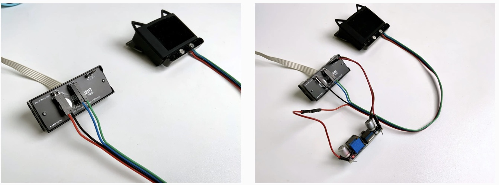

# PyHuskyLens Library
A universal MicroPython library for connecting the HuskyLens AI camera to robotics platforms. Supports both V1 and V2 hardware with I2C and Serial (UART) interfaces.

Compatible with:
- LEGO MINDSTORMS EV3 (via pybricks-micropython)
- LEGO SPIKE Prime
- LEGO MINDSTORMS Robot Inventor 51515
- ESP32 and other MicroPython boards


# Features

- **Auto-detection**: Automatically detects HuskyLens V1 or V2 hardware
- **Dual interface**: Supports both I2C and Serial (UART) communication
- **Memory optimized**: Uses bytearrays and efficient data structures
- **Full algorithm support**: All 14 AI algorithms including face recognition, object tracking, pose detection, hand recognition, and more
- **Extended detection**: Full support for V2 features like facial landmarks, hand keypoints (21 points), and body pose (17 keypoints)
- **Platform compatible**: Works with pybricks-micropython (no f-strings), standard MicroPython, and SPIKE/Robot Inventor

# Architecture

The library uses a clean base class pattern:
- **HuskyLensBase**: Contains all protocol logic and commands
- **HuskyLensI2C**: I2C transport implementation (V1 uses register 0x0C, V2 uses direct addressing)
- **HuskyLensSerial**: UART transport implementation (compatible with pybricks and standard MicroPython)

# Installation

## SPIKE Prime and Robot Inventor 51515
Copy and paste the contents of [Library/pyhuskylens.py](Library/pyhuskylens.py) above your script. 

## ESP32 / MicroPython
Simply import the library:
```python
from pyhuskylens import HuskyLensI2C, HuskyLensSerial
from machine import Pin, SoftI2C, UART

# For I2C
i2c = SoftI2C(scl=Pin(22), sda=Pin(21), freq=100000)
hl = HuskyLensI2C(i2c, debug=False)

# For Serial/UART
uart = UART(1, baudrate=9600, tx=Pin(17), rx=Pin(16))
hl = HuskyLensSerial(uart, debug=False)
```

## EV3 with pybricks-micropython
```python
from pybricks.iodevices import UARTDevice
from pybricks.parameters import Port
from pyhuskylens import HuskyLensSerial

uart = UARTDevice(Port.S1, 9600)
hl = HuskyLensSerial(uart, debug=False)
```

# Hardware Connection

## I2C Connection
- HuskyLens V1: I2C address 0x32
- HuskyLens V2: I2C address 0x50
- Connections: SDA, SCL, GND, 5V

## Serial/UART Connection
- Baudrate: 9600
- HuskyLens Pin 1 (Green) = Tx → Connect to Robot Rx
- HuskyLens Pin 2 (Blue) = Rx → Connect to Robot Tx
- Also connect GND and 5V

## SPIKE/Robot Inventor Wiring
To connect via UART, [use a breakout board](https://antonsmindstorms.com/product/uart-breakout-board-for-spike-and-ev3-openmv-compatible/) or solder the included HuskyLens header/wires to a spare Wedo2 plug pin 5 and 6 (ID1/ID2 lines). [Full How-To Blog](https://antonsmindstorms.com/2021/10/17/how-to-use-the-huskylens-with-lego-spike-prime-or-robot-inventor/)



Further details on pinout and ID1/ID2 [here](https://www.philohome.com/wedo2reverse/connect.htm). HuskyLens pinout details [here](https://wiki.dfrobot.com/HUSKYLENS_V1.0_SKU_SEN0305_SEN0336#target_3).

## Power
Power the HuskyLens with:
- USB battery pack (recommended)
- 5V from robot (if sufficient current available)
- For SPIKE/51515 with LPF power: Use a 3.3V-5V buck converter on M+ (8V) and M- (GND)

**Warning**: Using LPF Motor lines (M1/M2) with firmware 0.5+ may cause random crashes unless powered via USB. Either use external USB power or downgrade to [firmware 0.4.7](https://github.com/HuskyLens/HUSKYLENSUploader).

# Example Code

## SPIKE Legacy / Robot Inventor 51515
```python
from hub import button, port
# Assuming you installed the library through mpy_robot_tools:
from projects.mpy_robot_tools.pyhuskylens import HuskyLens, ALGORITHM_FACE_RECOGNITION

uart = port.A
uart.mode(1)
time.sleep_ms(300)
uart.baud(9600)
# Put voltage on M+ or M- leads
uart.pwm(100)
time.sleep_ms(2200)  # Give the huskylens some time to boot
time.sleep_ms(300)
uart.read(32)

# Initialize (auto-detects V1 or V2)
hl = HuskyLens('A', debug=False)

# Get firmware version (V1 only)
print(hl.get_version())

# Show text on screen
hl.clear_text()
hl.draw_text("Hello from SPIKE", x=120, y=120)

# Start face recognition
print("Starting face recognition")
hl.set_alg(ALGORITHM_FACE_RECOGNITION)

while not button.right.is_pressed():
    # Get detected faces
    blocks = hl.get_blocks()
    if len(blocks) > 0:
        face_x = blocks[0].x
        face_y = blocks[0].y
        error_x = (face_x - 155)
        error_y = (face_y - 120)
        print('Face found: ' + str(face_x) + ',' + str(face_y))
```

## ESP32 with I2C
```python
from machine import Pin, SoftI2C
from pyhuskylens import HuskyLensI2C, ALGORITHM_OBJECT_RECOGNITION, COLOR_GREEN
import time

# Initialize I2C
i2c = SoftI2C(scl=Pin(22), sda=Pin(21), freq=100000)
hl = HuskyLensI2C(i2c, debug=True)

if hl.version and hl.knock():
    print("Connected to HuskyLens V" + str(hl.version))
    
    # Set algorithm
    hl.set_alg(ALGORITHM_OBJECT_RECOGNITION)
    
    # Get detected objects
    blocks = hl.get_blocks()
    print("Found " + str(len(blocks)) + " objects")
    for block in blocks:
        print(block)
    
    # Draw text
    hl.draw_text("Hello!", 50, 50, COLOR_GREEN)
    time.sleep(2)
    hl.clear_text()
```

## EV3 with Serial (pybricks)
```python
from pybricks.iodevices import UARTDevice
from pybricks.parameters import Port
from pyhuskylens import HuskyLensSerial, ALGORITHM_LINE_TRACKING

# Initialize UART
uart = UARTDevice(Port.S1, 9600)
hl = HuskyLensSerial(uart, debug=False)

if hl.knock():
    print("Connected!")
    
    # Track lines
    hl.set_alg(ALGORITHM_LINE_TRACKING)
    
    # Get arrows
    arrows = hl.get_arrows()
    for arrow in arrows:
        print(arrow)
        print("Direction: " + str(arrow.direction))
```

## Advanced: Hand Recognition with Keypoints (V2 only)
```python
from pyhuskylens import ALGORITHM_HAND_RECOGNITION

hl.set_alg(ALGORITHM_HAND_RECOGNITION)
blocks = hl.get_blocks()

for hand in blocks:
    if hand.type == "HAND":
        print("Wrist: (" + str(hand.wrist_x) + "," + str(hand.wrist_y) + ")")
        print("Thumb tip: (" + str(hand.thumb_tip_x) + "," + str(hand.thumb_tip_y) + ")")
        print("Index finger tip: (" + str(hand.index_finger_tip_x) + "," + str(hand.index_finger_tip_y) + ")")
        # All 21 keypoints available
```

## Advanced: Pose Recognition with Skeleton (V2 only)
```python
from pyhuskylens import ALGORITHM_POSE_RECOGNITION

hl.set_alg(ALGORITHM_POSE_RECOGNITION)
blocks = hl.get_blocks()

for pose in blocks:
    if pose.type == "POSE":
        print("Nose: (" + str(pose.nose_x) + "," + str(pose.nose_y) + ")")
        print("Left shoulder: (" + str(pose.lshoulder_x) + "," + str(pose.lshoulder_y) + ")")
        print("Right shoulder: (" + str(pose.rshoulder_x) + "," + str(pose.rshoulder_y) + ")")
        # All 17 body keypoints available
```

# API Reference

## Algorithms
```python
ALGORITHM_FACE_RECOGNITION = 1
ALGORITHM_OBJECT_TRACKING = 2
ALGORITHM_OBJECT_RECOGNITION = 3
ALGORITHM_LINE_TRACKING = 4
ALGORITHM_COLOR_RECOGNITION = 5
ALGORITHM_TAG_RECOGNITION = 6
ALGORITHM_OBJECT_CLASSIFICATION = 7
ALGORITHM_OCR = 8  # V2 only
ALGORITHM_LICENSE_RECOGNITION = 9  # V2 only
ALGORITHM_QR_CODE_RECOGNITION = 10  # V2 only
ALGORITHM_BARCODE_RECOGNITION = 11  # V2 only
ALGORITHM_FACE_EMOTION_RECOGNITION = 12  # V2 only
ALGORITHM_POSE_RECOGNITION = 13  # V2 only
ALGORITHM_HAND_RECOGNITION = 14  # V2 only
```

## Methods

### Connection
- `knock()` - Test connection, returns True if connected
- `get_version()` - Get firmware version (V1 only)

### Algorithm Control
- `set_alg(algorithm)` - Switch to specified algorithm
- `set_multi_alg(*algorithms)` - Set multiple algorithms (V2 only, 2-5 algorithms)

### Detection
- `get_blocks(algorithm=None, ID=None, learned=False)` - Get detected blocks
- `get_arrows(algorithm=None, ID=None, learned=False)` - Get detected arrows
- `get(algorithm=None, ID=None, learned=False)` - Get both blocks and arrows

### Display
- `draw_text(text, x=10, y=10, color=COLOR_WHITE)` - Draw text on screen
- `clear_text()` - Clear text from screen
- `draw_rect(x1, y1, x2, y2, color=COLOR_WHITE)` - Draw rectangle (V2 only)
- `clear_rect()` - Clear rectangles (V2 only)

## Object Types

### Block
Properties: `x, y, width, height, ID, confidence, name, content, learned, type`

### Arrow
Properties: `x_tail, y_tail, x_head, y_head, ID, learned, direction, type`

### Face (V2 only)
Extends Block with: `leye_x, leye_y, reye_x, reye_y, nose_x, nose_y, lmouth_x, lmouth_y, rmouth_x, rmouth_y`

### Hand (V2 only)
Extends Block with 21 keypoints: wrist, thumb (cmc, mcp, ip, tip), index finger (mcp, pip, dip, tip), middle finger (mcp, pip, dip, tip), ring finger (mcp, pip, dip, tip), pinky finger (mcp, pip, dip, tip)

### Pose (V2 only)
Extends Block with 17 keypoints: nose, eyes, ears, shoulders, elbows, wrists, hips, knees, ankles

# Performance Notes

- **I2C**: V1 uses register-based communication (no flush needed), V2 uses direct addressing (requires buffer flushing)
- **Serial**: Compatible with both pybricks `waiting()` and standard MicroPython `any()` methods
- **Memory**: Uses bytearrays for efficient memory usage in MicroPython
- **Speed**: Typical read rates of 10-20 FPS depending on algorithm and platform

# Troubleshooting

1. **No device found**: Check I2C address (0x32 for V1, 0x50 for V2) or UART wiring
2. **Random crashes**: Ensure stable 5V power supply, avoid using motor power without USB backup
3. **No data returned**: Call `knock()` first to verify connection
4. **Slow performance**: Consider using I2C for faster communication than UART

# TODO
- Implement loading and saving learned models
- Implement saving screenshots and pictures
- Add more V2-specific features (multi-algorithm ratios)

# Credits
Original library by Anton's Mindstorms. Extended and refactored to support V2 hardware and additional platforms.